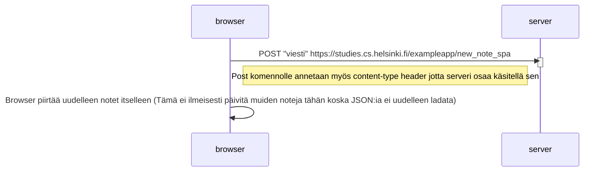

```mermaid
sequenceDiagram
    participant browser
    participant server

    browser->>server: POST "viesti" https://studies.cs.helsinki.fi/exampleapp/new_note_spa
    activate server
    deactivate server

    Note right of browser: Post komennolle annetaan myös content-type header jotta serveri osaa käsitellä sen

    browser->>browser: Browser piirtää uudelleen notet itselleen (Tämä ei ilmeisesti päivitä muiden noteja tähän koska JSON:ia ei uudelleen ladata)
```