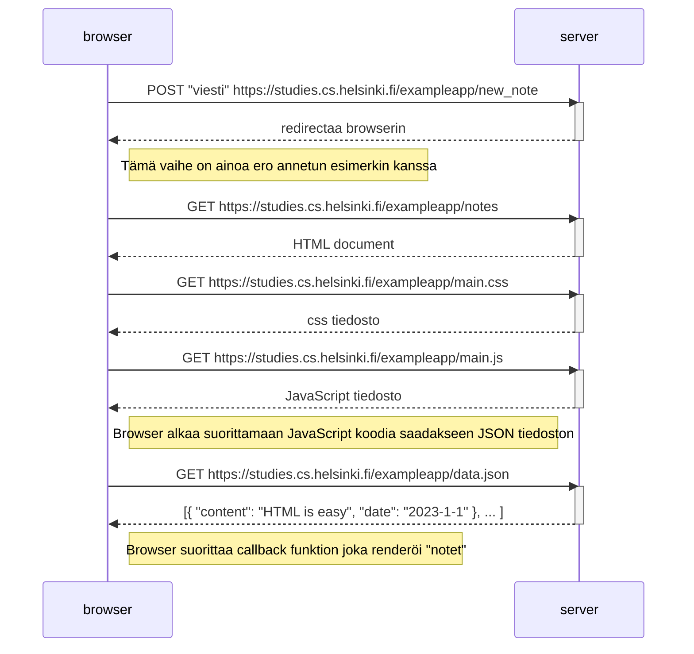

```mermaid
sequenceDiagram
    participant browser
    participant server

    browser->>server: POST "viesti" https://studies.cs.helsinki.fi/exampleapp/new_note
    activate server
    server-->>browser: redirectaa browserin
    deactivate server

    Note right of browser: Tämä vaihe on ainoa ero annetun esimerkin kanssa

    browser->>server: GET https://studies.cs.helsinki.fi/exampleapp/notes
    activate server
    server-->>browser: HTML document
    deactivate server

    browser->>server: GET https://studies.cs.helsinki.fi/exampleapp/main.css
    activate server
    server-->>browser: css tiedosto
    deactivate server
    
    browser->>server: GET https://studies.cs.helsinki.fi/exampleapp/main.js
    activate server
    server-->>browser: JavaScript tiedosto
    deactivate server
    
    Note right of browser: Browser alkaa suorittamaan JavaScript koodia saadakseen JSON tiedoston

    browser->>server: GET https://studies.cs.helsinki.fi/exampleapp/data.json
    activate server
    server-->>browser: [{ "content": "HTML is easy", "date": "2023-1-1" }, ... ]
    deactivate server

    Note right of browser: Browser suorittaa callback funktion joka renderöi "notet"
```